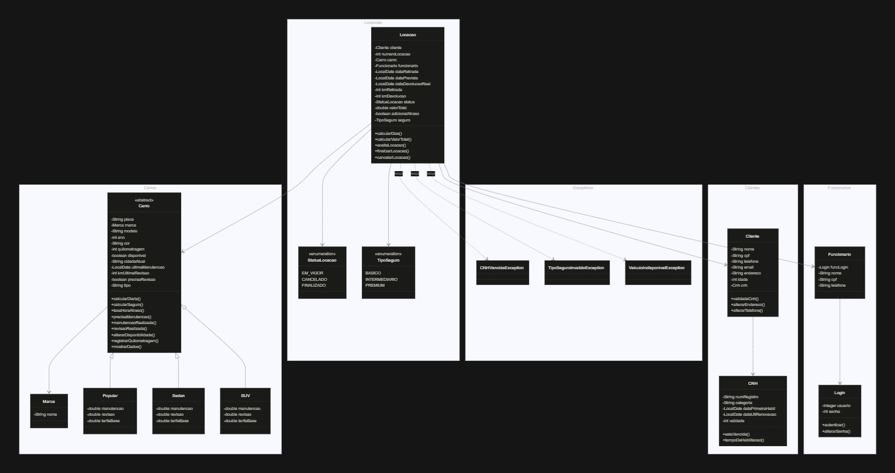
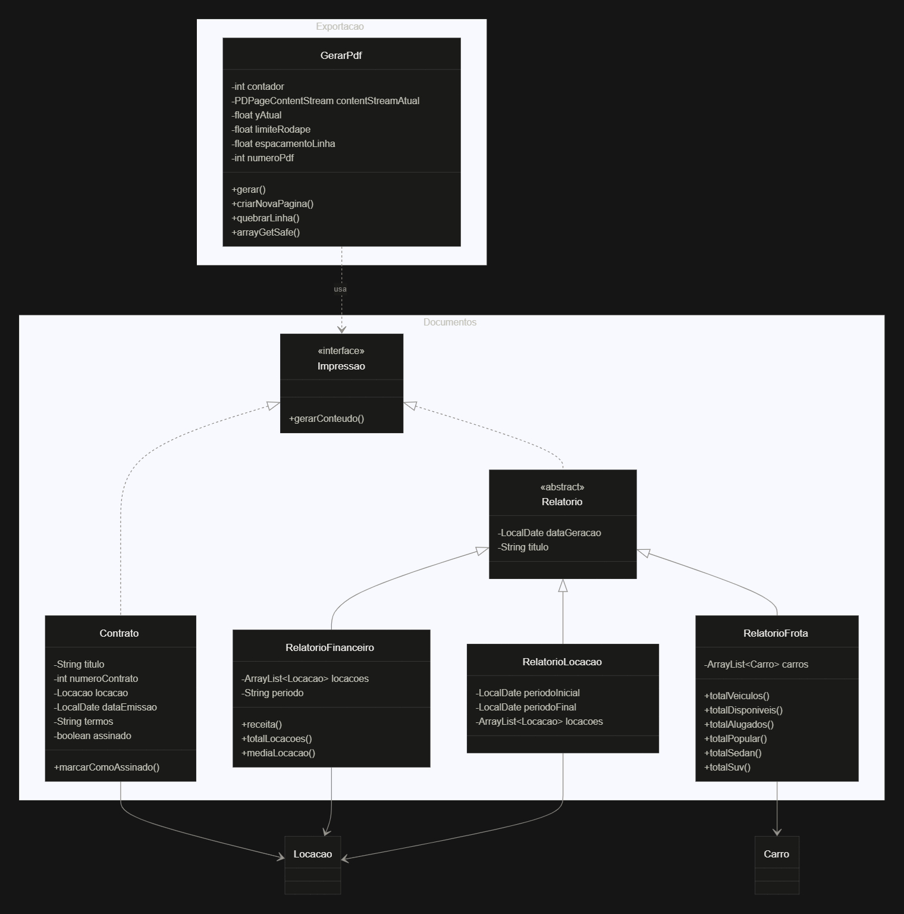

# 🚗 Locadora Só Bomba

Sistema de gerenciamento de locadora de veículos desenvolvido em Java, utilizando conceitos de Programação Orientada a Objetos (POO), persistência de dados em arquivos JSON e geração de documentos PDF.

---

## 👩‍💻 Desenvolvedora

**Nome:** Isis Lorca  
**Matrícula:** 1301392611007 

---

# 📌 Sobre o Projeto

O projeto consiste no desenvolvimento de um sistema para gerenciamento de uma locadora de veículos, substituindo controles manuais por uma aplicação capaz de realizar:

- Cadastro e gerenciamento de clientes;
- Controle de veículos e suas categorias;
- Gerenciamento de funcionários e autenticação;
- Processo completo de locação;
- Controle de contratos;
- Geração de relatórios;
- Exportação de contratos e relatórios em PDF;
- Persistência dos dados utilizando arquivos JSON.

A aplicação foi desenvolvida utilizando Java e executada através de uma interface de terminal.

---

# 🏗️ Arquitetura do Sistema

O projeto foi estruturado utilizando separação por responsabilidades, dividindo as classes em diferentes pacotes.

## Organização dos pacotes

```
src/

├── carros/
│   ├── Carro.java
│   ├── Marca.java
│   ├── Popular.java
│   ├── Sedan.java
│   └── Suv.java
│
├── clientes/
│   ├── Cliente.java
│   └── Cnh.java
│
├── documentos/
│   ├── Contrato.java
│   ├── Impressao.java
│   ├── Relatorio.java
│   ├── RelatorioFinanceiro.java
│   ├── RelatorioFrota.java
│   └── RelatorioLocacao.java
│
├── exceptions/
│   ├── CNHVencidaException.java
│   ├── TipoSeguroInvalidoException.java
│   └── VeiculoIndisponivelException.java
│
├── funcionarios/
│   ├── Funcionario.java
│   └── Login.java
│
├── locacoes/
│   └── Locacao.java
│
├── persistencia/
│   ├── Arquivos.java
│   ├── CarroAdapter.java
│   ├── DadosSistema.java
│   ├── LocalDateAdapter.java
│   └── Persistencia.java
│
├── exportacao/
│   └── GerarPdf.java
│
├── testes/
│   └── Teste.java
│
└── ui/
    ├── Main.java
    ├── MenuLogin.java
    ├── MenuPrincipal.java
    ├── MenuCliente.java
    ├── MenuCarro.java
    ├── MenuLocacao.java
    ├── MenuFinalizarLocacao.java
    ├── MenuHistorico.java
    ├── MenuContrato.java
    └── MenuRelatorios.java
```

---

# 🔧 Descrição da Arquitetura

O sistema foi desenvolvido utilizando o padrão de organização por camadas, separando as responsabilidades de cada grupo de classes.

## 🚘 Camada de Entidades

Responsável pela representação dos objetos principais do sistema.

Exemplos:

- `Carro`
- `Marca`
- `Cliente`
- `CNH`
- `Funcionario`
- `Login`
- `Locacao`
- `Contrato`

Essas classes possuem atributos e métodos de validação.

---

## 📄 Camada de Documentos

Responsável pela criação dos documentos gerados pelo sistema.

Possui:

- Contratos de locação;
- Relatórios financeiros;
- Relatórios da frota;
- Relatórios de locações.

A interface `Impressao` define o método:

```java
gerarConteudo()
```

permitindo que diferentes documentos sejam convertidos em PDF.

---

## 💾 Camada de Persistência

Responsável pelo armazenamento e carregamento dos dados.

A classe:

```
Persistencia.java
```

utiliza a biblioteca Gson para transformar os objetos Java em JSON e realizar a recuperação dos dados posteriormente.

Os dados são armazenados em:

```
dados/dadosSistema.json
```

---

## 📑 Camada de Exportação

Responsável pela geração dos arquivos PDF.

A classe:

```
GerarPdf.java
```

utiliza a biblioteca PDFBox para criar:

- Contratos;
- Relatórios financeiros;
- Relatórios da frota;
- Relatórios de locações.

---

## 🖥️ Interface de Usuário

O sistema possui uma interface baseada em terminal.

O fluxo principal é:

```
Login Funcionário
        |
        ↓
Menu Principal
        |
        ├── Cadastro Cliente
        |
        ├── Cadastro Carro
        |
        ├── Cadastro Locação
        |
        ├── Finalizar Locacao
        |
        ├── Contratos
        |
        ├── Histórico de Locacoes
        |
        └── Relatórios

```

---

# 📊 Diagrama de Classes

Diagrama principal do software:



Diagrama da geração de documentos:



---

# ▶️ Como Executar o Projeto

## Pré-requisitos

Necessário possuir instalado:

- Java JDK 17 ou superior;
- IDE compatível com Java (Eclipse, IntelliJ IDEA ou VS Code).

Bibliotecas utilizadas:

- Gson;
- Apache PDFBox.

Os arquivos `.jar` encontram-se na pasta:

```
lib/
```

---

# Compilação

Caso utilize terminal:

Entre na pasta do projeto:

```bash
cd Locadora
```

Compile os arquivos:

```bash
javac -cp "lib/*" -d bin src/**/*.java
```

---

# Execução

Execute a classe principal:

```bash
java -cp "bin;lib/*" ui.Main
```

---

# 🧪 Cenários de Teste Realizados

## Teste 1 - Cadastro e Persistência

### Objetivo

Verificar se os objetos criados são corretamente armazenados no arquivo JSON.

### Processo realizado

Foram cadastrados:

- Marca Renault;
- Veículo Renault Kwid;
- Cliente Amanda Silva;
- CNH do cliente;
- Funcionário;
- Login do funcionário;
- Locação;
- Contrato.

Resultado esperado:

Os dados devem ser salvos em:

```
dados/dadosSistema.json
```

Resultado:

✅ Dados persistidos corretamente.

---

# Teste 2 - Carregamento dos Dados

### Objetivo

Verificar se os dados salvos podem ser recuperados posteriormente.

Resultado:

```
Marcas: 1
Carros: 1
Clientes: 1
Funcionários: 1
Locações: 1
```

Resultado:

✅ Dados carregados corretamente.

---

# Teste 3 - Exibição dos Objetos

### Objetivo

Verificar os métodos `toString()` e recuperação das informações.

Foram exibidos:

- Cliente;
- CNH;
- Veículo;
- Funcionário.

Resultado:

✅ Informações apresentadas corretamente.

---

# Teste 4 - Geração de Contratos PDF

### Objetivo

Validar a criação automática de contratos.

Processo:

- Criada uma locação;
- Gerado contrato;
- Exportado para PDF.

Resultado:

✅ PDF criado corretamente.

---

# Teste 5 - Geração de Relatórios PDF

Foram testados:

## Relatório Financeiro

Verificação:

- Receita total;
- Quantidade de locações finalizadas;
- Média de valores.

Resultado:

✅ Funcionando.

---

## Relatório Frota

Verificação:

- Quantidade total de veículos;
- Veículos disponíveis;
- Veículos alugados;
- Categorias dos veículos.

Resultado:

✅ Funcionando.

---

## Relatório Locação

Verificação:

- Período informado;
- Clientes;
- Veículos;
- Seguro;
- Status da locação.

Resultado:

✅ Funcionando.

---

# 📚 Tecnologias Utilizadas

- Java;
- Programação Orientada a Objetos;
- Gson;
- Apache PDFBox;
- JSON;
- Git/GitHub.

---

# 👩‍💻 Considerações Finais

O projeto permitiu aplicar conceitos de orientação a objetos, como:

- Encapsulamento;
- Herança;
- Polimorfismo;
- Abstração;
- Interfaces;
- Tratamento de exceções.

Além disso, foram aplicados conceitos de persistência de dados, geração de documentos e organização de software utilizando separação de responsabilidades.